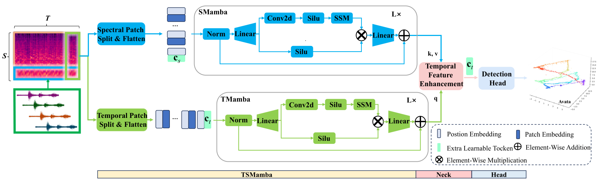
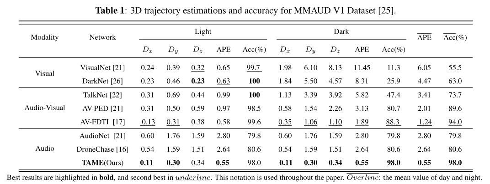
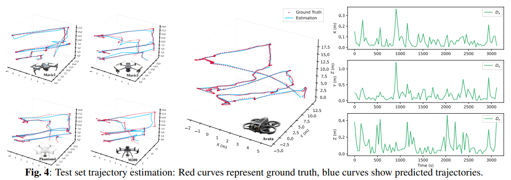

# TAME
This is the repository for "[TAME: Temporal Audio-based Mamba for Enhanced Drone Trajectory Estimation and Classification](http://arxiv.org/abs/2412.13037)".

# Installation
```bash
$ conda create -n your_env_name python=3.10.13
$ pip install torch==2.1.1 torchvision==0.16.1 torchaudio==2.1.1 --index-url https://download.pytorch.org/whl/cu118
$ pip install -r requirement.txt
$ pip install causal_conv1d==1.1.0
$ cd kernels/selective_scan
$ pip install .
$ cd ..
$ cd ..
$ pip install .
```


# Data
The dataset comes from the [CVPR UG2+ challenge](https://ug2-uav-tracking.github.io/dataset24_t5.html). For details, please see [MMAUD](https://github.com/ntu-aris/MMAUD). The data used in the paper is processed and segmented data, which can be downloaded from [Baidu Cloud](https://pan.baidu.com/s/1ZsX6x6hO52KRTN9k7F5yQw?pwd=r649). For audio segmentation, please refer to this [link](https://docs.google.com/document/d/12u2E4NLQzOtWxfTxPNV5JmIW54Tqq5v7CQbI7BGwuQw/edit?pli=1&tab=t.0).
# Overview



# Experiment



# Acknowledgement
This project is based on Mamba ([paper](https://arxiv.org/abs/2312.00752), [code](https://github.com/state-spaces/mamba)), VMamba ([paper](https://arxiv.org/abs/2401.10166), [code](https://github.com/MzeroMiko/VMamba)). Thanks for their wonderful works.

# Citation
If you find TAME is useful in your research or applications, please consider giving us a star 🌟 and citing it by the following BibTeX entry.
```bash
@inproceedings{xiao2025tame,
  title={Tame: Temporal audio-based mamba for enhanced drone trajectory estimation and classification},
  author={Xiao, Zhenyuan and Hu, Huanran and Xu, Guili and He, Junwei},
  booktitle={ICASSP 2025-2025 IEEE International Conference on Acoustics, Speech and Signal Processing (ICASSP)},
  pages={1--5},
  year={2025},
  organization={IEEE}
}
```
